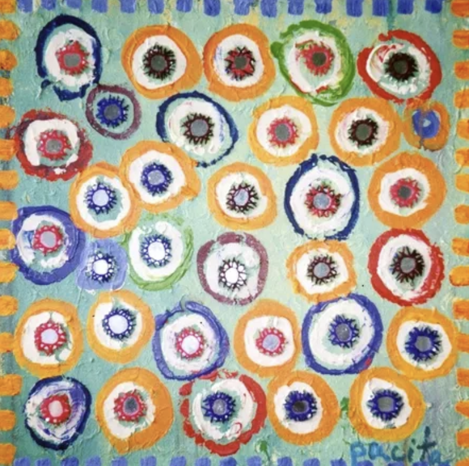
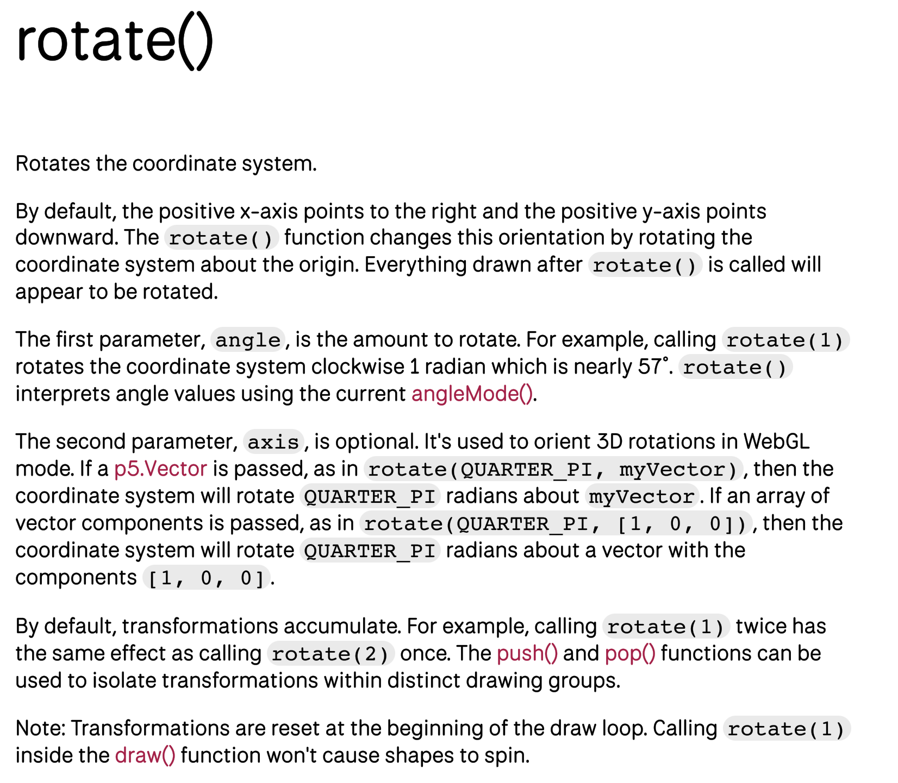

# Quiz 8 – Design Research

##Part 1: Imaging Technique Inspiration

**Inspiration:**  
Pacita Abad – *Wheels of Fortune* (1981)

This vibrant textile artwork features layered, radiating circular forms resembling spinning wheels. I am inspired by its hypnotic repetition, radial symmetry, and kinetic energy. For my individual animation, I plan to emphasize this sense of motion by rotating each circular segment independently. This technique aligns with the assignment goals by abstracting visual elements while preserving the artwork’s essence. The circular motif is ideal for modular, class-based animation code, offering flexibility and visual impact.

**Example Images:**  

  
*Pacita Abad, "Wheels of Fortune", Detail View*

  
*Repetition and radial layout of circular forms*

---

##Part 2: Coding Technique Exploration

**Coding Technique:**  
`p5.js` – Using `rotate()` with `push()` and `pop()` for modular circular animations.

This coding technique allows each circular shape to be animated independently by wrapping it in `push()`/`pop()` and applying `translate()` and `rotate()` transformations. It’s perfect for replicating the spinning-wheel effect in *Wheels of Fortune*, allowing wheels to rotate at different speeds or directions. This approach supports modular, clean, and layered animation code, aligning with the project’s modular coding requirements.

**Example Screenshot:**  

  
*Source: p5.js Transform Example*

**Example Code:**  
[p5.js rotate + push/pop example](https://p5js.org/examples/transform-rotate.html)

```js
function draw() {
  background(255);
  translate(100, 100);
  rotate(frameCount * 0.01);
  rect(-15, -15, 30, 30);
}